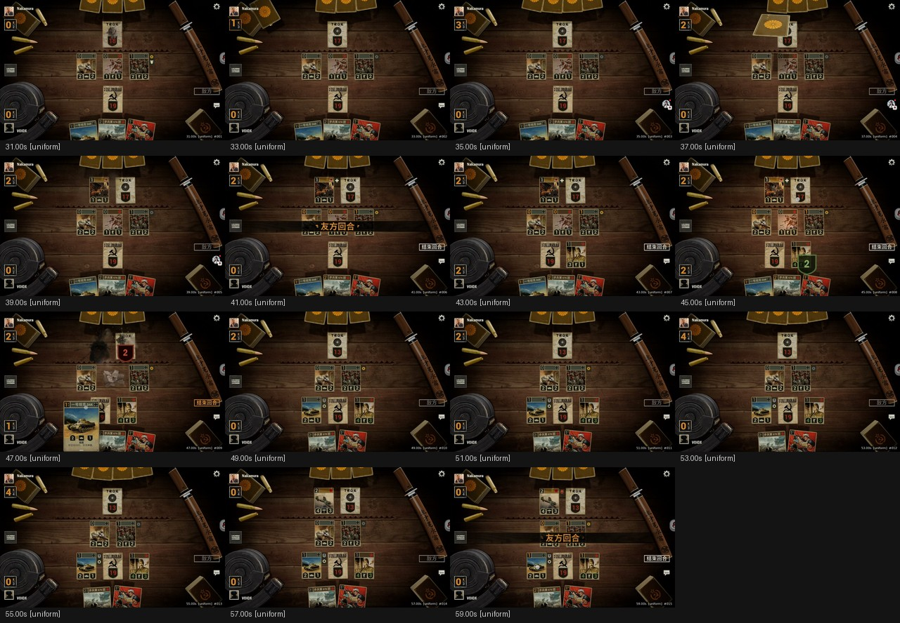
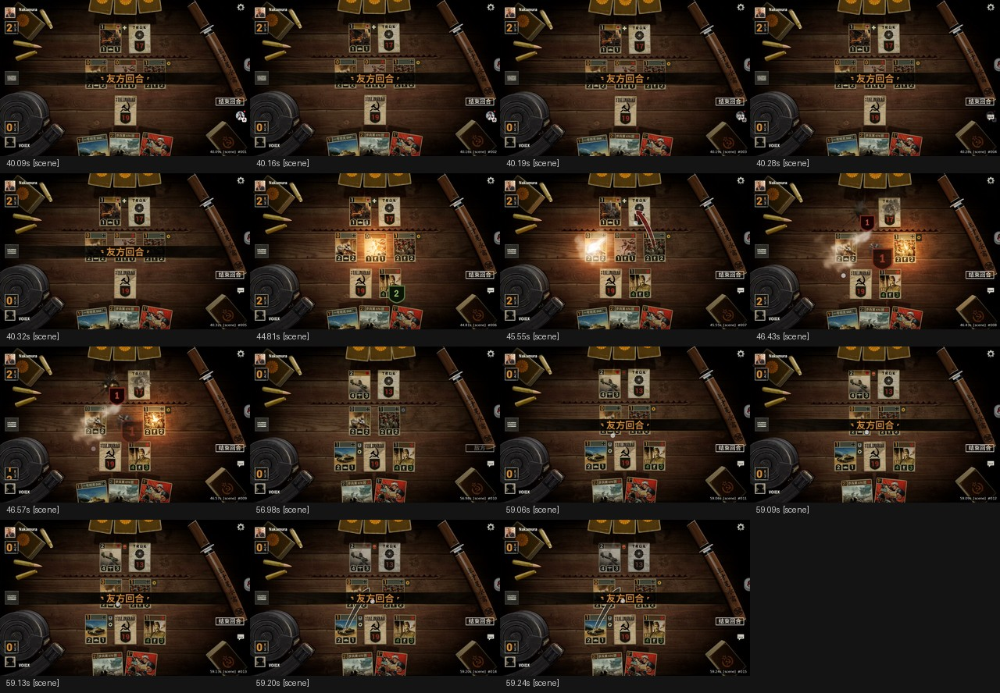
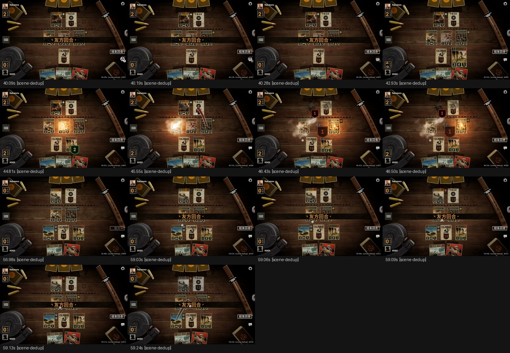
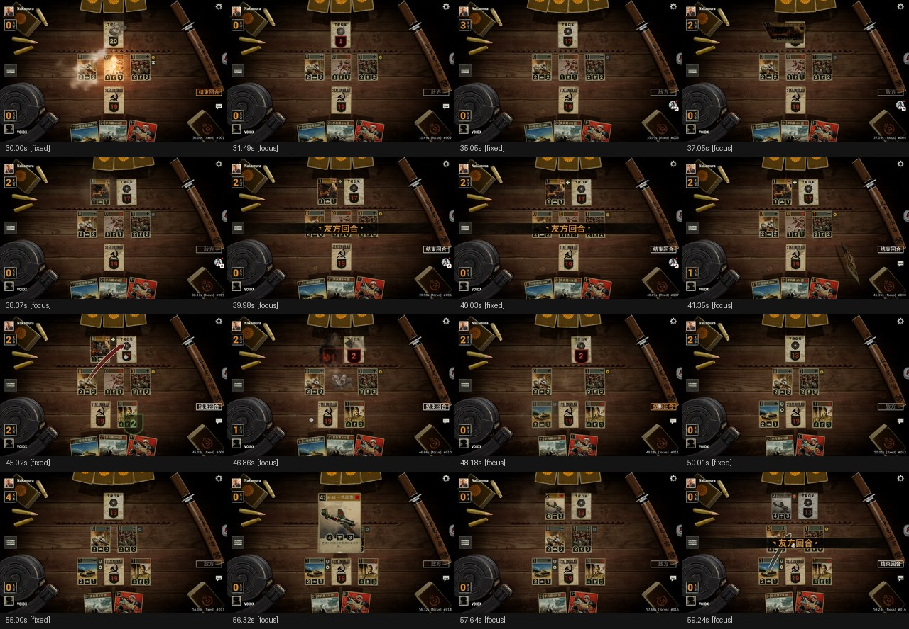
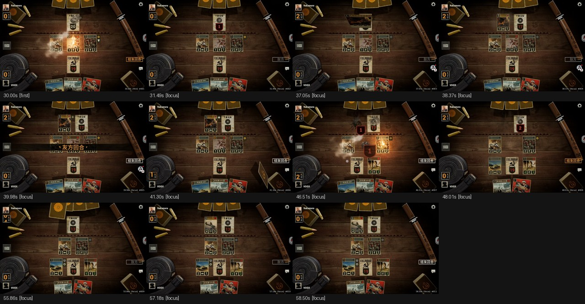
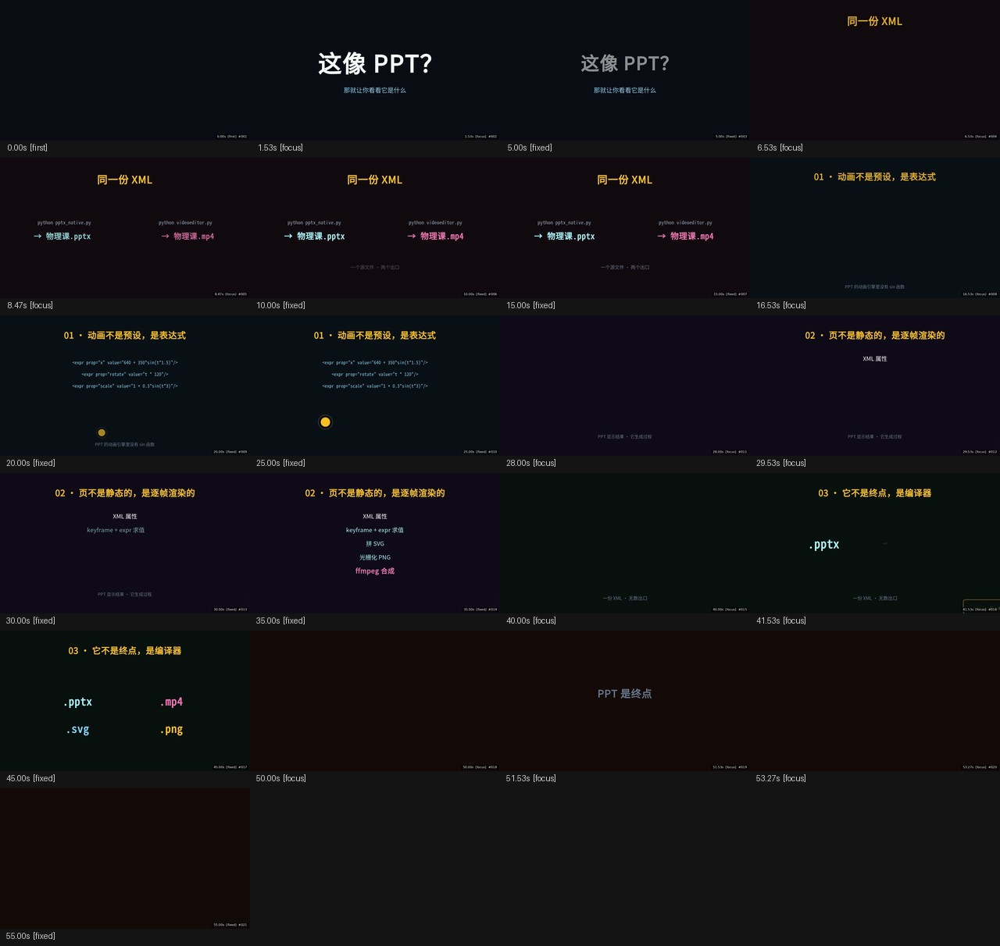

# VideoEditor & Views

> ~~猎奇算法与AI的爱情故事~~

---

## 读前先知

本README相当猎奇，就算是同我的风格了，情感倾诉是有一套的，呵呵呵。

但是我大发慈悲，今天正经一轮。

## 这是什么

一个 **纯 CLI 的视频智能抽帧工具**。输入视频，输出：

- `contact_sheet.jpg` — 一张图，包含 N 张关键帧缩略图
- `frames/*.jpg` — 关键帧原图，右下角带时间戳水印
- `report.json` — 结构化数据，每帧带时间戳和 reason

**目的**：让不支持视频多模态的 AI，通过"图像 + 时间轴"读懂视频。

## 这不是什么

- ❌ 不是视频剪辑工具（不剪、不合成、不转码，只抽帧）
- ❌ 不是视频摘要生成器（不生成文字，只输出关键帧）
- ❌ 不是 scene detection 的替代（是不同的判据，见下方对比）
- ❌ 不是实时工具（离线处理，对短视频几秒完成）

## 依赖

### 必需

    Python 3.10+
    numpy
    Pillow
    ffmpeg / ffprobe（须编译 libx264 + aac）
    cairosvg           （videoeditor 需要）
    EGL / GLES 3.0 系统库 （videoeditor 需要）

### 可选（自动探测，无则回退）

    scipy               预处理 / 形态学加速
    opencv-python       形态学加速（比 scipy 更快）
    latex + dvisvgm     LaTeX 公式资产渲染
    fontconfig          fc-list / fc-match，中文字体族解析

### 各工具最低依赖

    videoframe      numpy, Pillow, ffmpeg / ffprobe
    videoeditor     numpy, Pillow, cairosvg, ffmpeg / ffprobe, EGL/GLES
    xmlmusic        numpy

### EGL / GLES 探测

    videoeditor 启动时自动探测 libEGL / libGLESv2 路径，覆盖：
      · Android    /system/lib64/libEGL.so
      · Debian     /usr/lib/{x86_64,aarch64,arm}-linux-gnu/libEGL.so.1
      · Arch       /usr/lib64/libEGL.so.1
      · Fedora     /usr/lib64/libEGL.so.1
      · Raspberry Pi  /opt/vc/lib/libEGL.so
      · Mesa 软件渲染

    探测失败可显式指定：
      XMLVE_EGL_LIB=/path/to/libEGL.so.1
      XMLVE_GLES_LIB=/path/to/libGLESv2.so.2

### 关于 ffmpeg 硬件编码

    videoeditor 启动时自动探测 QSV / NVENC。
    存在且可用 → 用 --exp-qsv / --exp-nvenc 启用。
    不存在 → 回退到 libx264 软件编码。

### 不需要

    · 不需要 GPU 驱动安装（EGL/GLES 由系统提供）
    · 不需要 C++ 编译
    · 不需要 Node.js / npm
    · 不需要 Docker
    · 不需要 API key（纯离线）

---

## 开发环境实测

本机（Android / Termux）实测依赖版本：

    Python        3.14.6
    numpy         2.4.4
    Pillow        12.3.0
    cairosvg      2.9.1
    scipy         1.18.1
    ffmpeg        Termux 官方包（libx264 + aac 齐全）
    latex         texlive
    dvisvgm       texlive
    fc-list       系统 fontconfig
    中文字体      Noto Sans CJK SC 等 43 个
    EGL/GLES      /system/lib64/（Android 系统自带）

未安装：

    opencv-python   （有 scipy 代替，功能不受影响）
    vtracer         （image.py 的位图转 SVG，非三工具范围）
    mido            （xmlmusic 未来扩展，当前未使用）

---

## 正文

我去不早说，DeepSeek居然不会剪视频 ~~这不废话~~。好吧但是用软件也不是不行，好慢啊。所以这个Project就出生了。

JUSTFORHAVEFUN(void)如此说道，他老是这么神经，本以为很牛逼，结果是DeepSeek写的(乐)。不过，XML写视频的确牛，也就只有像他这样的神经能够想得出来了，哈哈。然后他还搞了个什么xmlmusic.其实本质上和直接写代码生成是一样的，可他非要打包成一个Python，入口还写了一堆exp功能，明摆着就是不让你用他也不肯把自己的焚诀交出来，就只能眼睁睁看着他跑一个2D视频竟然只要30秒别人却要足足1.25分钟，~~你这糟老头子真的坏得很~~

其实他的3D场景和GPU优化全部都是DeepSeek写的，就这个乐子人，连OpenGL都搞不了还说什么以后肯定要搞Vulkan😂。据说这个任务居然耗费了他足足1块5大洋，估计他的钱包已经瘪得不成样子了，不过好是好在，他的父母终于大发慈悲，天降甘露，犹如迹一般，给了他足足5块钱让他给同学还钱，于是他表演许家印给了同学现金5块，网上的钱是一个没还，就当是没有手续费的微信充钱了。好吧，其实JUSTFORHAVEFUN(void)根本就没想过写这个只不过他实在是一天脑子闲得慌然后汗畅淋漓的写下了：

我要做一个能够给任何有多模态的人工智能做视频的工具

然后打开DeepSeek Harness就开始许愿。

没想到真的给他搞出来，然后他又疯了一样，不停给他加优化，就变成是个样子， 也不知道他怎么想的，一个190 KB的文件就是搁那儿的，依赖堆的如天一样，实在没想明白，他到底为什么要这么搞。

然后他又搞了一个VideoFocus(VideoFrame里面搭载)算法，本质上不就是高斯模糊再加上把每一帧的 RGB 通道当成一个三通道张量、用边缘复制的方式外扩一圈、取每个像素的四邻域均值与它自身的差、把三个通道的差值分别平方后相加、得到一张叫做"离散拉普拉斯响应图"的二维标量场、再把它按 99% 分位数二值化、按 16×16 分块统计每块里"处于边缘"的像素占比、得到一张"轮廓密度图"、同时对 RGB 三通道求全局均色、用欧氏距离量出每个像素与"平均色"的偏离、对这张偏离图做半径为 8 的高斯模糊得到"色彩异常图"、把两张图按 `density × (1 + 4 × anomaly)` 相乘得到"显著度图"、再做半径 6 的高斯模糊与 UnsharpMask 锐化、最后和上一帧的显著度图相减、取 99.5 百分位数作为"焦点异常分数"、超过阈值就判定为一帧关键帧——**这就是我们的"focus 判据"**，一个听起来很唬人实际上你也能在 30 行里写完的离散拉普拉斯算子。

听着非常简单，其实本来就非常简单，我现在就把代码抄给你

```python
def _discrete_laplacian(rgb):
    H, W = rgb.shape[:2]
    p = np.empty((H + 2, W + 2, 3), dtype=np.float32)
    p[1:-1, 1:-1] = rgb
    p[0, 1:-1] = rgb[0];   p[-1, 1:-1] = rgb[-1]
    p[1:-1, 0] = rgb[:, 0]; p[1:-1, -1] = rgb[:, -1]
    p[0, 0] = rgb[0, 0]; p[0, -1] = rgb[0, -1]
    p[-1, 0] = rgb[-1, 0]; p[-1, -1] = rgb[-1, -1]
    out = p[1:-1, 1:-1, :] * 4.0
    out -= p[:-2, 1:-1, :]
    out -= p[2:,  1:-1, :]
    out -= p[1:-1, :-2, :]
    out -= p[1:-1, 2:,  :]
    out *= 0.25
    np.multiply(out, out, out=out)
    return (out[..., 0] + out[..., 1]) + out[..., 2]
```

你看是不是很简单

我可以和你对比一下啊啊，就市面上常见这些，它也是直接被拉爆

---

## 对比：同一段视频，四种算法

用一段 **30 秒的 KARDS 对局**（卡牌游戏，桌面背景大面积静止、卡牌和小数字局部变化）做对比。这段视频的特点是：

- **90% 面积是静态桌面**
- 卡牌移动、数字变化、技能特效**只占 5~20% 面积**
- 关键时刻（友方回合、攻击结算、卡牌部署）**整帧平均像素差很小**

选取区间 `[30, 60]`，四种算法各限制 **15 帧**上限。

### 结果一览

| 算法 | 帧数 | 平均间隔 | 抓关键帧 | 备注 |
|---|---|---|---|---|
| **uniform** | 15 | 2.00s | ✗ | 居然是老资历，肯定牛逼 |
| **scene** (阈值 0.3) | **0** | — | — | **默认阈值下完全失效，兄弟，你怎么抽了** |
| **scene** (阈值 0.15) | **0** | — | — | 怎么就给我选了零帧 |
| **scene** (阈值 0.05) | 9 | 3.33s | 部分 | 到 **1/6 阈值**能够抓到9帧(还是多少我忘了) |
| **scene-dedup** | 14 | 2.14s | 部分 | dHash 去重 |
| **focus**（本工具） | **11** | 2.73s | ✓ | **全部是关键帧** |
| **focus + fixed** | 我忘了 | 很长很长 | ✓ | 多插入 fixed 帧 |

反正我说的不准，自己找吧

### uniform — 均匀间隔

```
N 帧 → 间隔 = 时长 / N
```

方法最朴素：把视频切成等长窗口，每个窗口取一帧。

**居然是老资历，那应该很牛逼吧**



### scene — ffmpeg scene detection

ffmpeg 内置的 `select='gt(scene, T)'`，判据是**整帧平均像素差**。

**KARDS 场景下的实测**：

| 阈值 | 抓到的帧数 |
|---|---|
| 0.30（默认） | **0** |
| 0.15 | **0** |
| **0.05** | 9 |

**0.3 到 0.05 是 6 倍的阈值差距**。原因：KARDS 桌面占 90% 面积，卡牌变化只影响 5~20%，**平均值被大面积静态背景稀释**，`scene_score` 永远上不去。

**但是很多人说这个很好，我觉得可能是我写的代码太差了，你们加油**



### scene-dedup — scene + dHash 去重

先跑 scene detection，再用 dHash 把近重复帧去掉（peepshow 用的思路）。

**问题**：

- **我代码写的差，所以效果差**



### focus — 本工具

判据从"整帧平均像素差"换成**局部剧烈变化**：

```
focus_score = percentile(|当前焦点图 - 上一帧焦点图|, 99.5)
```

**只看最剧烈的 0.5% 像素**。但是我觉得也不是很好吧



### focus + fixed vs focus 无 fixed

fixed 是"每 N 秒必抽一帧"的保底机制。在 KARDS 这种**每秒都有事**的视频里，fixed 反而是噪声。

**有 fixed 版本**：11 帧中 4 帧标 `[fixed]`，画面平淡、无信息量。

**无 fixed 版本**：11 帧全部标 `[focus]`，**帧帧都在讲一件事**——爆炸、部署、回合切换、再爆炸。



### 对比总图

同一段视频 30 秒，四种算法的抽帧结果并排：

| uniform | scene | focus |
|---|---|---|
|  |  |  |

**核心差异**：

- uniform：**保证时间覆盖，但不知道哪帧重要**
- scene：**判据是"整帧平均差"**
- focus（本工具）：**判据是"局部最剧烈差"**



**竖屏 + rotation 90 自动处理**：

KARDS 视频容器是 1968×3150，实际显示是 3150×1968（横版）。videoframe 自动读 rotation 元数据并修正宽高，用户不用管。


---

特别鸣谢：
DeepSeek V4.1 Flash
感谢DeepSeek帮我制作的3D渲染器和2D加速(含GPU与SVG合并)，虽然用的是老骨头OpenGL但你就说能不能跑吧。

哦对，忘说了这里所有的参数

# 三大工具完整参数

---

## 一、videoframe.py — 智能抽帧

输入视频，输出关键帧 + contact_sheet + JSON。

### 输入 / 输出

    --in=PATH              输入视频（必填）
    --out=DIR              输出目录（默认 keys）
    --range=A:B            只处理 [A, B] 秒区间

### 抽帧规则

    --every=N              固定间隔秒数（fixed 规则，默认 2.0）
    --diff-threshold=X     内容变化阈值 0~1（默认 0.08）
    --focus-threshold=X    焦点异常阈值 0~1（默认 0.30）
    --cooldown=X           两次抽帧最小间隔秒数（默认 0.05）
    --no-fixed             关闭 fixed 规则（只留 focus/content）
    --no-focus             关闭 focus 规则（只留 fixed/content）
    两个都加               只剩 content 规则

### 数量控制

    --max-frames=N         每 chunk 上限（默认 300）
    --total-max-frames=N   跨 chunk 总上限（默认 0 = 不启用）

### 尺寸控制

    --frame-w=N            输出帧宽度上限（默认 1280）
    --frame-h=N            输出帧高度上限（默认 760）
    --frame-max=N          旧接口：长边限制（默认 0 = 用 w/h）

    语义：装进 (frame_w, frame_h) 边界框，等比缩放，不变形
    · 横版 1920×1080 → 1280×720
    · 竖版 1968×3150 → 474×760
    · 4K 3840×2160   → 1280×720

### 性能

    --analysis-width=N     分析分辨率宽度（默认 640；320 快 7 倍）
    --analysis-stride=N    每 N 帧分析一次（默认 2）
    --no-precompress       关闭预压缩（调试用）
    --precompress-min-sec=N  小于此时长不压缩（默认 30）

### 分块 / 并行

    --chunk-sec=N          每 N 秒切一个 chunk（默认 0 = 不分块）
    --chunk-parallel=N     并行 chunk 数（默认 2）

### 输出

    --ext=jpg              帧格式：jpg / jpeg / png（默认 jpg）
    --no-watermark         关闭右下角水印
    --watermark-style=bar  bar（半透明黑底白字）/ text（白字黑描边）/ none
    --json=PATH            JSON 报告路径（默认 <out>/report.json）

### 典型组合

    # 摘要模式（推荐）
    python videoframe.py --in=v.mp4 --out=keys/ \
        --every=5.0 --diff-threshold=0.15 --focus-threshold=0.45 \
        --cooldown=1.5 --max-frames=40 --analysis-width=320

    # 高密度视频（游戏/直播）——关掉 fixed
    python videoframe.py --in=kards.mp4 --out=keys/ \
        --no-fixed --focus-threshold=0.43 --cooldown=1.3 \
        --max-frames=20 --analysis-width=320

    # 长视频 + 分块并行
    python videoframe.py --in=lecture.mp4 --out=keys/ \
        --chunk-sec=120 --chunk-parallel=3 \
        --every=5.0 --max-frames=20 --total-max-frames=60 \
        --analysis-width=320

    # 只抽固定间隔（关掉智能）
    python videoframe.py --in=v.mp4 --out=keys/ \
        --every=1.0 --diff-threshold=2.0 --no-focus

---

## 二、videoeditor.py — XML 视频渲染

### 基础

    <xml>                  输入 XML（位置参数，默认 project.xml）
    --out=PATH             输出路径（默认 out.mp4）
    --quality=QUALITY      精度预设

    quality 可选：
      ultra      原分辨率 · fast CRF18 → -c copy      （最高质量）
      fast       原分辨率 · ultrafast CRF16 → medium CRF23 （默认）
      special    640×360 · ultrafast CRF16             （快速预览）
      qsv        原分辨率 · h264_qsv                    （Intel 硬件）
      nvenc      原分辨率 · h264_nvenc                  （NVIDIA 硬件）

### 渲染范围

    --render-frame=T       渲染单帧（t 秒）
    --render-range=A:B     渲染 [A, B] 秒区间
    --format=svg|png|both  单帧输出格式（配合 --render-frame）

### 性能 / 并行

    --workers=N            每进程线程数（默认 min(4, CPU)）
    --chunk=N              单 chunk 最大秒数（默认 12.0）
    --exp-pipeline=N       流水线进程数（auto / 0 = 自动）

### 激进优化

    --aggressive=0~3       一键开启分层优化
    --merge-aggressive=0~3 overlay 合并激进度
    --stable               等价 --aggressive=0

    aggressive 级别：
      0   全部关闭（最稳）
      1   --exp-encode
      2   + --exp-merge-svg + --exp-merge-static
      3   + --exp-pipeline=auto

### 实验特性（--exp-*）

    --exp-encode               分块编码参数优化
    --exp-merge-svg            同时间窗动态 overlay 合并
    --exp-merge-static         纯静态 overlay 合并成单帧
    --exp-gpu-2d               强制启用 GPU 2D 光栅化
    --exp-gpu-2d=off           强制回退 cairo
    --exp-autocairo            静止段首帧用 cairo（质量优先）
    --autocairo-min=N          静止段最小帧数阈值（默认 30）
    --exp-auto-split           超长 clip 自动切分
    --exp-auto-split=N         手动指定切分秒数
    --exp-passPNG              跳过 PNG，rawvideo 直通
    --exp-pass-png             同上（别名）
    --exp-bmp                  帧中间格式用 BMP（更快但更大）
    --exp-qsv                  QSV 硬件编码
    --exp-nvenc                NVENC 硬件编码

### 分块控制

    --max-chunk-weight=N   单 chunk mesh/element 上限（默认 400）
    --merge-chunk-sec=N    小于此长度的相邻 chunk 尝试合并（默认 18.0）

### 运行控制

    --resume               复用已有 chunk（断点续传）
    --keep                 保留中间文件
    --purge                完成后清理所有中间文件
    --preview              半分辨率快速预览
    --workdir=PATH         工作目录（默认 ./tmp/gappt_work）
    --no-silent-audio      逐 chunk 处理音频（默认延迟到最终）

### MP4 工具箱（独立子命令，无需 XML）

    # 查看信息
    python videoeditor.py --mp4-info video.mp4

    # 抽帧
    python videoeditor.py --mp4-snapshot video.mp4 \
        --at=3.5                        # 按时间
        --frame=100                     # 或按帧号
        --format=png|svg|both           # 输出格式
        --out=out_base                  # 输出路径

    # 裁剪
    python videoeditor.py --mp4-trim video.mp4 \
        --range=10:20                   # 起止秒
        --precise                       # 精确裁剪（重编码）
        --out=cut.mp4

    # 音量
    python videoeditor.py --mp4-volume video.mp4 \
        --volume=0.5 --out=quieter.mp4

    # 画布变换
    python videoeditor.py --mp4-transform video.mp4 \
        --crop=W:H:X:Y                  # 裁剪
        --scale=W:H                     # 缩放
        --pos=X:Y                       # 位置（配合 scale 做 pad）
        --out=transformed.mp4

### 环境变量

    XMLVE_2D                    force / cairo / auto
    XMLVE_NO_CULL               1（关闭视锥剔除）
    XMLVE_DEBUG_CULL            1（打印剔除日志）
    XMLVE_DYN_INST              1（启用动态实例化）
    XMLVE_DEBUG_DYN_INST        1（打印动态实例化日志）
    XMLVE_SYNTHETIC_BOLD        0 / 1 / 2 / strong
    XMLVE_AUTOCAIRO             1（等价 --exp-autocairo）
    XMLVE_AUTOCAIRO_MIN         N（静止段最小帧数）
    XMLVE_MERGE_COPY            1（合并时跳过重编码）
    XMLVE_FRAME_EXT             .png / .bmp
    XMLVIDEO_WORKDIR            PATH（工作目录）
    XMLVE_EGL_LIB               PATH（显式指定 libEGL）
    XMLVE_GLES_LIB              PATH（显式指定 libGLESv2）
    XMLVE_MAX_CHUNK_WEIGHT      N（单 chunk mesh 上限）
    XMLVE_MERGE_CHUNK_SEC       N（chunk 合并秒数）
    XMLVE_AUTO_SPLIT            N（auto_split 秒数）
    XMLVE_PASS_PNG              1（passPNG 模式）
    XMLVE_INSTANCE_THRESHOLD    N（自动 instancing 分组阈值，默认 16）

### XML 层面的属性开关

    <space3d fastpath="1">      开启 auto-inst（视觉会打折）
    <space3d shading="flat">    贴纸感光照
    <space3d shading="lit">     正确 3D 光照（默认）

    <animate prop="pos|rotate|scale">       常规关键帧
    <animate prop="projectile" gravity="7.8" life="1.1"
             pressure="1 - 0.65*min(1, t/8)">
        抛物线物理模式

    <param mode="constant|random-box|random-sphere|random-shell|
                fib-sphere|palette">
        per-instance 参数分布

---

## 三、xmlmusic.py — XML 音乐合成

### 输入 / 输出

    <xml>                  输入 XML（位置参数，必填）
    --out=PATH             输出音频（默认 <xml>.wav）
    --midi=PATH            同时导出 MIDI

### 顶层 XML 属性（<music>）

    bpm                     节拍速度（默认 60）
    duration                总时长秒（默认 8）
    sample_rate             采样率（默认 44100）
    stereo                  立体声（默认 true）
    loop                    无缝循环（默认 false）
    loop-tail               循环尾部叠加秒数（默认 0）
    out                     默认输出路径（可被 --out 覆盖）

### 音色（<instruments><instrument>）

    piano, sine, saw, square, triangle, bass, strings, organ, bell, noise
    kick, snare, hihat, tom, clap, crash

### 轨道（<track>）

    id                      轨道标识
    instrument              引用 instrument id
    volume                  音量 0~1
    pan                     声像 -1~1

### 音符（<note>）

    at                      起始时间（b=beat，s=秒，裸数字=秒）
    pitch                   音高（C4 / MIDI 编号）
    dur                     时长
    vel                     力度 0~1
    attack/decay/sustain/release  ADSR 覆盖（可选）

    例：<note at="0b" pitch="C4" dur="1b" vel="0.8"/>

### 和弦（<chord>）

    at, dur, vel            同 note
    pitch                   和弦名（Cmaj7 / Am7 / Fmaj7 / G6 等）
    octave                  根音八度（默认 3）

    支持的和弦：
      maj, min, dim, aug, sus2, sus4, 5,
      7, maj7, m7, m7b5, dim7, 6, m6, add9, 9, maj9, m9

    例：<chord at="0b" dur="4b" pitch="Cmaj7" vel="0.5" octave="3"/>

### 琶音（<arp>）

    at, dur, pitch, vel     同 chord
    step                    每步时长
    order                   up / down / updown

    例：<arp at="0b" dur="4b" pitch="Cmaj7" step="0.5b" order="updown"/>

### 鼓点（<pattern>）

    at                      起始时间
    instrument              覆盖 track 的 instrument
    beat                    X=重击，x=轻击，.=空
    step                    每步时长
    bars                    重复次数
    vel                     重击力度
    weak                    轻击相对力度（默认 0.5）

    例：<pattern at="0b" instrument="kick"
                 beat="X...X...X...X..." step="0.25b" bars="4"/>

### 效果器（<effects>）

    <delay time="0.5b" feedback="0.25" mix="0.15"/>
        time      延迟时间
        feedback  反馈系数
        mix       干湿比

    <reverb room="0.55" damp="0.5" mix="0.25"/>
        room      空间大小 0~1
        damp      阻尼 0~1
        mix       干湿比

### 典型用法

    # 生成 WAV
    python xmlmusic.py bgm.xml

    # 指定输出
    python xmlmusic.py bgm.xml --out=music.wav

    # 顺便导出 MIDI（可在 DAW 里继续编辑）
    python xmlmusic.py bgm.xml --out=music.wav --midi=music.mid

---

## 通用约定

    时间单位      秒。音乐里 b 后缀表示 beat
    坐标单位      像素（XML 里）
    旋转单位      XML 用度；GLSL 内部用弧度
    颜色格式      #rgb / #rrggbb / #rrggbbaa / CSS 颜色名
    坐标分隔      空格，不是逗号（"1 2 3"）
    BPM 同步      xmlmusic 里 bpm 定义；<sync bpm="X" beat="N"/>
                  可在 videoeditor 里同步

---

## 速查

    从视频抽代表帧
      python videoframe.py --in=v.mp4 --out=keys/ \
          --max-frames=40 --analysis-width=320

    高密度视频抽帧
      上面 + --no-fixed --cooldown=1.3

    长视频抽帧
      上面 + --chunk-sec=120 --chunk-parallel=3

    渲染 XML 视频
      python videoeditor.py project.xml --aggressive=3 --exp-pipeline=3

    单帧预览
      python videoeditor.py project.xml --render-frame=3.5 --format=png

    从 MP4 抽帧（不做智能）
      python videoeditor.py --mp4-snapshot v.mp4 --at=3.5

    生成音乐
      python xmlmusic.py bgm.xml --out=bgm.wav --midi=bgm.mid